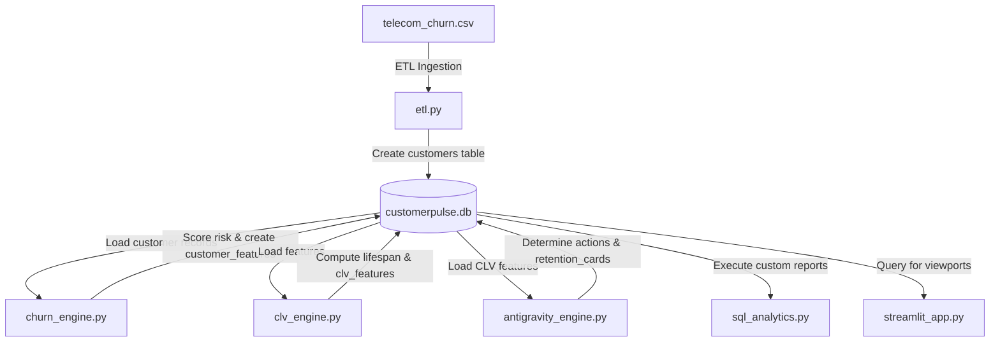

#  Grahak AI — Customer Retention Intelligence Platform

[](https://www.python.org/)
[](https://streamlit.io/)
[](https://sqlite.org/)
[](LICENSE)

Grahak AI is an end-to-end, proactive customer retention and intelligence platform designed to help businesses detect customer cancellation risks early, project Customer Lifetime Value (CLV), prioritize recovery efforts, and generate personalized AI-driven retention campaign strategies.

---

##  Business Problem
Customer cancellation (churn) represents a massive, often silent leak in subscription-based and enterprise business models. Key challenges include:
* **Late Detection:** Identifying churn signals only after a customer has decided to cancel.
* **Lack of Prioritization:** High-value customers and low-value accounts receive the same general treatment.
* **Inefficient Marketing ROI:** Pitching expensive loyalty offers to low-risk customers, wasting budget.
* **Manual Bottlenecks:** Customer success teams manually writing emails instead of sending targeted, contextual offers.

---

##  Solution
Grahak AI solves these problems by providing an automated, closed-loop retention intelligence workflow:
1. **automated ETL Data Processing:** Standardizes customer data pipelines and ingests them into SQLite.
2. **Predictive Churn Scoring:** Dynamically assigns risk metrics based on customer tenure, spend trends, and monthly rates.
3. **CLV & Revenue At Risk Forecasts:** Calculates the financial exposure of churn and models the expected recovery revenue.
4. **AI Strategy Generator:** Generates personalized retention incentives and contextual email templates.
5. **Interactive Executive Dashboard:** Renders clean SaaS analytics and interactive customer workspaces for relationship managers.

---

##  Key Features
* **Live Revenue Protection Dashboard:** Compact above-the-fold grid displaying total revenue protected, recovery efficiency, and real-time revenue timeline steps.
* **Executive Presentation Mode:** Embedded 6-slide deck explaining the product mission, problem space, architecture, and business metrics.
* **Interactive Customer Workspace:** Select custom customer profiles to examine churn score indicators, CLV, and revenue at risk.
* **AI Recovery Campaign Generator:** Instant, rule-based generation of targeted marketing campaigns (Premium Discounts, Loyalty Points, Feedback Surveys) with custom-tailored customer success emails.
* **Revenue Planner & Trend Analysis:** Clear visualization of churn risk categories and revenue metrics across various customer tiers.

---

##  Technology Stack
* **Frontend Dashboard:** [Streamlit](https://streamlit.io/) (configured with a warm beige VoteChain-inspired SaaS styling)
* **Data Processing:** [Pandas](https://pandas.pydata.org/), [NumPy](https://numpy.org/)
* **Database & Ingestion:** [SQLite3](https://docs.python.org/3/library/sqlite3.html)
* **Visualizations:** [Plotly Express](https://plotly.com/python/)
* **Language:** Python 3.8+

---

##  Architecture Overview



For a detailed review, check our [System Architecture Guide](file:///c:/Users/DELL/OneDrive/Desktop/SQL%20PROJECT/docs/architecture.md).

---

##  Installation & Local Setup

### Prerequisites
* Python 3.8 or higher installed on your system.

### Step-by-Step Setup

1. **Clone the repository:**
   ```bash
   git clone https://github.com/HiteshBhatiwal/Grahak-AI.git
   cd Grahak-AI
   ```

2. **Create and activate a virtual environment:**
   ```bash
   python -m venv .venv
   # Windows:
   .venv\Scripts\activate
   # macOS/Linux:
   source .venv/bin/activate
   ```

3. **Install the required packages:**
   ```bash
   pip install -r requirements.txt
   ```

4. **Initialize and run the data pipeline:**
   Execute the scripts in order to ingest data, calculate features, and compute strategies:
   ```bash
   python src/etl.py
   python src/churn_engine.py
   python src/clv_engine.py
   python src/antigravity_engine.py
   ```

5. **Start the Streamlit application:**
   ```bash
   streamlit run src/streamlit_app.py
   ```

---

##  Project Structure
```
Grahak-AI/
├── assets/                  # Project assets (visual branding)
│   └── screenshots/         # Core dashboard screenshots
├── data/                    # Database and source files
│   ├── telecom_churn.csv    # Source customer dataset
│   └── customerpulse.db     # SQLite analytics database
├── docs/                    # Technical & business documentation
│   ├── architecture.md      # System & database architecture
│   ├── business_impact.md   # Investor-ready financial analysis
│   └── submission_summary.md# Hackathon submission summary
├── src/                     # Core application source code
│   ├── antigravity_engine.py# Action recommendation engine
│   ├── churn_engine.py      # Churn scoring models
│   ├── clv_engine.py        # CLV calculation models
│   ├── etl.py               # Data pipeline & ingestion
│   ├── sql_analytics.py     # SQL report queries
│   └── streamlit_app.py     # Streamlit web dashboard
├── README.md                # Project README landing page
├── audit_report.md          # Pre-restructure audit report
├── final_review.md          # Multi-perspective hackathon review
└── requirements.txt         # Package dependencies
```

---

##  Dashboard Screenshots Section

Below are the primary visual highlights of the Grahak AI interface (once captured and placed in `assets/screenshots/`):

1. **Dashboard Home:** Overview of protected revenue metrics, recovery rate badge, and execution timeline.
2. **Revenue Protection Workspace:** Interactive customer records with churn score meters.
3. **Recovery Campaign Generator:** Contextual recommendations and customized customer success email templates.
4. **Revenue Planner:** Distribution of risk categories and value tiers.
5. **Business Impact Summary:** Total projected CLV and recovery rate analytics.

---

##  Future Improvements
* **Automated Email Workflows:** Integration with SendGrid or SMTP to dispatch generated retention campaigns.
* **CRM Integrations:** Direct hooks to sync retention priority tiers with Salesforce, HubSpot, or Zoho CRM.
* **Machine Learning Models:** Upgrade the heuristic scoring engine to a predictive XGBoost or LightGBM model.
* **Multi-Warehouse Connectors:** Support direct imports from Snowflake, BigQuery, and PostgreSQL.

---

##  Business Impact
* **₹648.96 Lakh** Total Revenue at Risk from medium and high-risk accounts.
* **₹194.69 Lakh** Expected Revenue Recovered by deploying automated campaign offers.
* **30% Recovery Efficiency** overall across targeted pilot cohorts.

For complete financial breakdown, see the [Business Impact Guide](file:///c:/Users/DELL/OneDrive/Desktop/SQL%20PROJECT/docs/business_impact.md).

---

## 📄 License
This project is licensed under the MIT License - see the LICENSE file for details.
