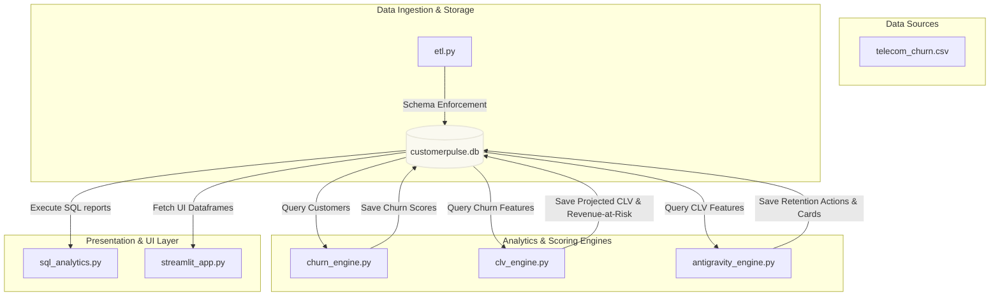
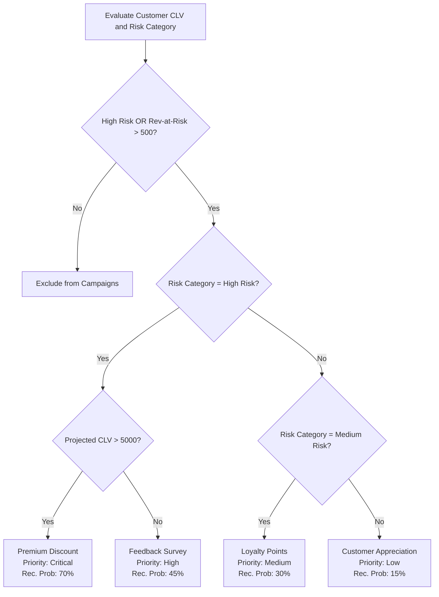

# System Architecture Documentation

This document describes the technical architecture, data pipeline, database schema, scoring rules, and analytical engine structure of Grahak AI.

---

## 1. System Overview
Grahak AI is a modular customer retention platform consisting of an ingestion layer, features and valuation engine layers, a relational database layer, an offline reporting CLI, and an interactive Streamlit UI dashboard.

---

## 2. Ingestion & Storage Layer (ETL)
* **File:** `src/etl.py`
* **Input:** `data/telecom_churn.csv`
* **Target Table:** `customers` in `data/customerpulse.db`

### Ingestion Protocol
1. **Validation:** Checks if the source CSV exists.
2. **Data Cleaning:**
   * Replaces whitespace-only cells in `TotalCharges` with `0.0`.
   * Standardizes string columns by trimming trailing/leading whitespace.
   * Drops rows with missing or empty `customerID` or `Churn`.
3. **Schema Standardisation:**
   * Converts column headers from PascalCase/camelCase to snake_case using regular expressions.
   * Standardizes ID representation (`i_d` -> `id`).
4. **Relational Load:**
   * Re-creates the `customers` table with strict types.
   * Appends records via Pandas' `to_sql`.

### SQLite Table Schema: `customers`
| Column | Type | Description |
| :--- | :--- | :--- |
| `customer_id` | TEXT (PK) | Unique identifier for each customer |
| `gender` | TEXT | Gender of the customer |
| `senior_citizen` | INTEGER | Flag indicating if senior citizen (1/0) |
| `tenure` | INTEGER | Months with the service provider |
| `monthly_charges`| REAL | Monthly bill amount |
| `total_charges` | REAL | Total accumulated bill amount |
| `churn` | INTEGER | Churn status indicator (1 = Churned, 0 = Active) |

---

## 3. Churn Scoring Engine
* **File:** `src/churn_engine.py`
* **Input Table:** `customers`
* **Target Table:** `customer_features`

The churn engine evaluates three dimensions of customer risk: tenure, spend trends, and monthly bill size.

### Risk Rules (Max: 100 points)

#### A. Tenure Contribution (Max: 40 points)
* `tenure < 12 months`: **40 points**
* `12 <= tenure <= 24 months`: **25 points**
* `25 <= tenure <= 48 months`: **10 points**
* `tenure > 48 months`: **0 points**

#### B. Spend Trend Contribution (Max: 30 points)
* Calculates average monthly spend: `total_charges / tenure` (or fallback to `monthly_charges` if `tenure` is 0).
* Computes spend trend ratio: `monthly_charges / avg_monthly_spend`.
* `spend_trend < 0.8` (indicating declining spend): **30 points**
* `0.8 <= spend_trend <= 1.0`: **15 points**
* `spend_trend > 1.0`: **0 points**

#### C. Monthly Charges Contribution (Max: 20 points)
* `monthly_charges > ₹70`: **20 points**
* `₹40 <= monthly_charges <= ₹70`: **10 points**
* `monthly_charges < ₹40`: **0 points**

### Risk Categorization
* `churn_score >= 70`: **High Risk**
* `40 <= churn_score <= 69`: **Medium Risk**
* `churn_score < 40`: **Low Risk**

---

## 4. Customer Lifetime Value (CLV) Engine
* **File:** `src/clv_engine.py`
* **Input Table:** `customer_features`
* **Target Table:** `clv_features`

The CLV engine models the financial worth of a customer and quantifies risk exposure.

### Calculations

1. **Estimated Lifespan:**
   * If customer has already churned (`churn == 1`): `estimated_lifespan_months = tenure`
   * If customer is active (`churn == 0`): `estimated_lifespan_months = tenure + 24`

2. **Projected CLV:**
   $$\text{Projected CLV} = \text{avg\_monthly\_spend} \times \text{estimated\_lifespan\_months}$$

3. **Revenue At Risk:**
   * **High Risk:** $\text{avg\_monthly\_spend} \times 24$ months
   * **Medium Risk:** $\text{avg\_monthly\_spend} \times 12$ months
   * **Low Risk / Other:** $0.0$

---

## 5. Decision & Recommendation Engine
* **File:** `src/antigravity_engine.py`
* **Input Table:** `clv_features`
* **Target Table:** `retention_cards`

Filters accounts that are classified as "High Risk" or have a financial exposure (`revenue_at_risk`) exceeding ₹500.

### Recommendation Decision Tree

### Campaign Performance Metric
* **Expected Revenue Recovered:**
  $$\text{Expected Revenue Recovered} = \text{revenue\_at\_risk} \times \text{recovery\_probability}$$

---

## 6. Streamlit Presentation Dashboard
* **File:** `src/streamlit_app.py`
* **Views:**
  * **Summary Metrics:** High-level totals of revenue at risk, protected value, and recovery rate.
  * **Executive Slide Deck:** Multi-slide presentation overlay for investor decks.
  * **Timeline Flow:** Visual guide of the retention workspace cycle.
  * **Interactive Workspace:** Dropdown-driven layout for individual customer analysis, showing personalized email templates generated by `antigravity_engine.generate_email`.
